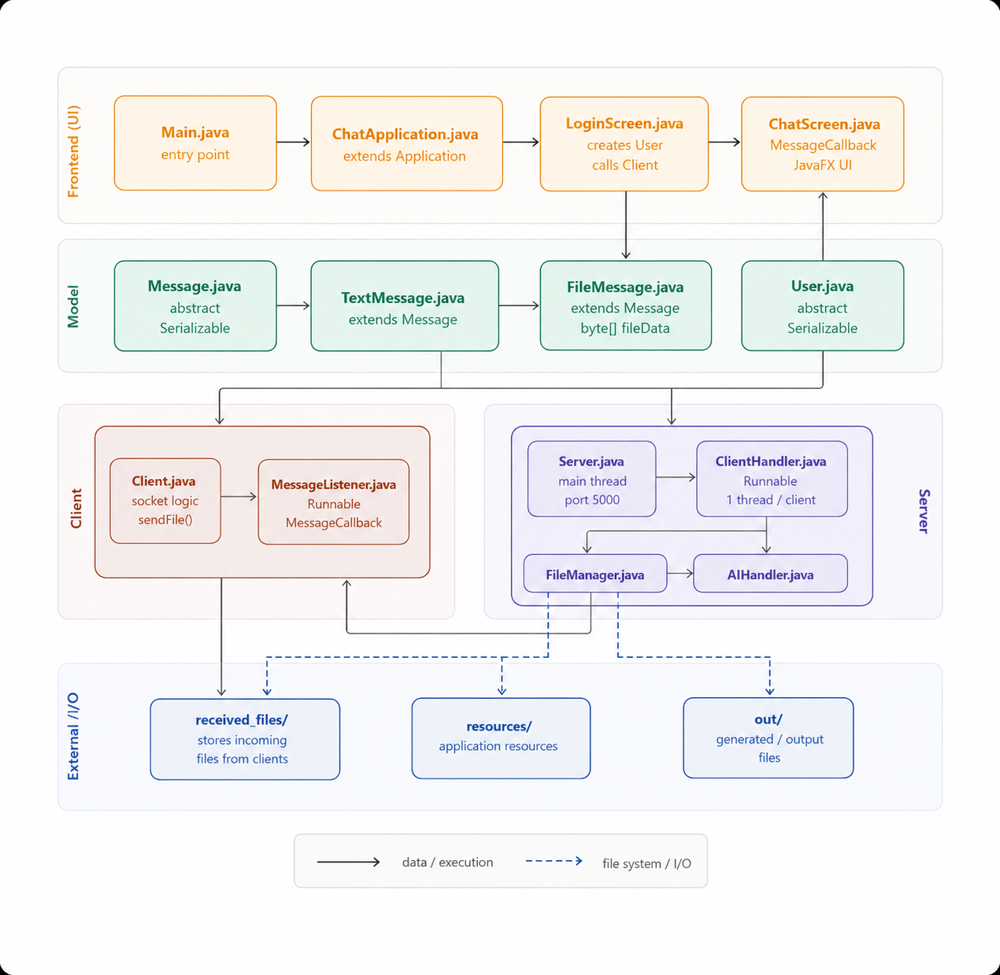

# 💬 ChatApp — Real-Time Multi-Client Chat Application

A real-time chat application built with Java, featuring multi-client support, file and image sharing, an AI assistant, and a modern JavaFX UI. Built as a Final Course Project for Advanced Programming at EJUST.

---

## 🗺️ Project Architecture



The project is divided into four layers:
- **Frontend (UI)** — JavaFX screens handling all user interaction
- **Model** — Pure data classes shared between client and server
- **Client** — Networking logic connecting to the server
- **Server** — Multi-threaded server handling all connected clients
- **External I/O** — Files saved to disk by the server

---

## ✨ Features

- Real-time multi-client text messaging
- File and image sharing over the network using byte streams
- Inline image preview with an Open button
- 🤖 AI Assistant — type `/ai your question` for an AI response powered by Groq
- Admin and Regular User roles with different permissions
- Sender name and timestamp displayed above every message bubble
- Chat history saved automatically to `chatlog.txt`
- Received files saved to `received_files/` on the server
- Graceful server shutdown — type `quit` in the server console
- Clean disconnect handling and exception management
- Multi-threaded — one thread per client for real-time performance

---

## 📋 Prerequisites

Before running the application, make sure you have the following installed:

- **Java JDK 17 or higher** — [Download here](https://www.oracle.com/java/technologies/downloads/)
- **JavaFX SDK 26** — [Download here](https://gluonhq.com/products/javafx/) *(download the SDK version, not Javadoc or Jmods)*
- **IntelliJ IDEA** — recommended IDE for running this project
- **A free Groq API key** — [Get one here](https://console.groq.com) *(for the AI assistant feature)*

---

## ⚙️ Setup & Installation

### 1. Clone or Extract the Project

Extract the project zip file and open the `Chatapp` folder in IntelliJ IDEA via **File → Open**.

### 2. Add JavaFX to the Project

1. Extract the JavaFX SDK zip somewhere permanent (e.g. `C:\javafx-sdk-26\`)
2. In IntelliJ: **File → Project Structure → Libraries → + → Java**
3. Navigate to the `lib` folder inside your JavaFX SDK and select it
4. Click Apply and OK

### 3. Configure VM Options

1. Go to **Run → Edit Configurations**
2. Select the `Main` run configuration
3. Add the following to **VM options** (replace the path with your actual JavaFX lib path):

```
--module-path "C:\javafx-sdk-26\lib" --add-modules javafx.controls,javafx.fxml
```

### 4. Set the Groq API Key

1. Go to **Run → Edit Configurations**
2. Select the `Main` run configuration
3. Under **Environment Variables**, add:
   - Name: `GROQ_API_KEY`
   - Value: your actual Groq API key

> ⚠️ Never hardcode your API key in the source code. Always use environment variables.

---

## 🚀 How To Run

> ⚠️ Always start the Server before the Client.

### Step 1 — Start the Server

Run `Server.java` located in the `server` package. You should see:

```
[Server] Starting on port 5000...
[Server] Type 'quit' to stop the server.
[Server] Waiting for clients...
```

### Step 2 — Start the Client

Run `Main.java` located directly in `src`. The login screen will appear. Enter a username, choose a role (User or Admin), and click **Connect**.

### Step 3 — Test with Multiple Clients

1. Go to **Run → Edit Configurations**
2. Check **Allow multiple instances**
3. Run `Main.java` again — a second chat window will open

### Step 4 — Connect from Another Machine (Same Network)

1. Find your IP address — open Command Prompt and run `ipconfig`
2. Look for **IPv4 Address** (e.g. `192.168.1.5`)
3. In `Client.java`, change:
```java
private static final String HOST = "localhost";
```
to:
```java
private static final String HOST = "192.168.1.5"; // your actual IP
```

### Step 5 — Stop the Server

In the server console, type:
```
quit
```
This notifies all connected clients and shuts down cleanly.

---

## 🤖 Using the AI Assistant

In the chat, type:
```
/ai explain what polymorphism is
```
The 🤖 AI Assistant will respond to everyone in the chat within a few seconds, powered by the Groq API running the `llama-3.3-70b-versatile` model.

---

## 📁 Project Structure

```
Chatapp/
├── src/
│   ├── Main.java                      — Entry point, launches the JavaFX app
│   ├── client/
│   │   ├── Client.java                — Handles all networking on the client side
│   │   └── MessageListener.java       — Background thread listening for incoming messages
│   ├── model/
│   │   ├── Message.java               — Abstract base class for all messages
│   │   ├── TextMessage.java           — A regular text chat message
│   │   ├── FileMessage.java           — A file/image sent over the chat
│   │   ├── User.java                  — Abstract base class for all users
│   │   ├── RegularUser.java           — Standard user with chat permissions
│   │   └── AdminUser.java             — Admin user with moderation permissions
│   ├── server/
│   │   ├── Server.java                — Main server, listens for connections
│   │   ├── ClientHandler.java         — One thread per client, handles messaging
│   │   ├── FileManager.java           — Saves chat logs and received files to disk
│   │   └── AIHandler.java             — Communicates with Groq AI API
│   └── ui/
│       ├── ChatApplication.java       — JavaFX Application class
│       ├── LoginScreen.java           — Login screen UI
│       └── ChatScreen.java            — Main chat window UI
├── resources/
│   └── styles.css                     — UI styling
└── docs/
    └── dependency-map.png             — Project architecture diagram
```

---

## 💾 Generated Files at Runtime

When the server runs, it automatically creates:

| File/Folder | Description |
|---|---|
| `chatlog.txt` | Full history of all text messages sent |
| `received_files/` | All files sent through the chat are saved here |

These appear in the project root directory.

---

## 🏗️ OOP Design Highlights

| Concept | Implementation |
|---|---|
| Abstract Classes | `Message`, `User` |
| Inheritance | `TextMessage`, `FileMessage` extend `Message` — `RegularUser`, `AdminUser` extend `User` |
| Polymorphism | `format()` overridden differently in each `Message` subclass — `handleMessage()` uses pattern matching on message type |
| Interfaces | `Serializable` (Java built-in) — `MessageCallback` (custom, implemented by `ChatScreen`) — `Runnable` (implemented by `ClientHandler` and `MessageListener`) |
| Multithreading | One `ClientHandler` thread per connected client + `MessageListener` background thread on client side + AI responses on a dedicated thread |
| File Handling | `FileManager` writes `.txt` logs and saves binary files using byte streams — `FileMessage` carries raw `byte[]` data over the socket |
| Encapsulation | All fields private, accessed through getters only |
| External API | `AIHandler` communicates with Groq via Java's built-in `HttpClient` |

---

## 👤 User Roles

| Role | Can Chat | Can Send Files | Can Use /ai | Can Kick Users |
|---|---|---|---|---|
| Regular User | ✅ | ✅ | ✅ | ❌ |
| Admin | ✅ | ✅ | ✅ | ✅ |